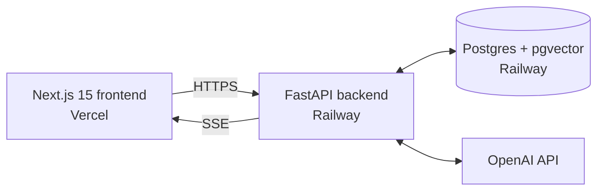

# AskDocs

Ask grounded questions about your PDFs. Streamed answers with inline citations linking back to the exact source passage.

**Live demo:** *coming soon. Vercel URL goes here after the Phase 4 deploy.*

---

## What it does

Upload a PDF or DOCX, then chat with it. Every answer:

- **Stays grounded.** The model is constrained to the retrieved chunks. If the answer isn't in the document, it says so instead of guessing.
- **Cites sources inline.** Every claim carries a `[chunk:N]` citation rendered as a clickable pill that opens the source passage in a side panel.
- **Streams.** Tokens appear in real time over Server-Sent Events.

The retrieval combines vector similarity (semantic) with BM25 (exact-term) using Reciprocal Rank Fusion, measured against an evaluation harness that scores recall@5, MRR, and answer faithfulness with numbers.

---

## Highlights

- **Hybrid retrieval, measured.** Adding BM25 + RRF on top of vector search lifted MRR from 0.65 → 0.72 (+10.7%) on the [BERT-paper benchmark](eval/results/milestones/). The recall@5 ceiling was already 0.92. Full numbers and analysis in `eval/results/milestones/`.
- **Validated citations.** Models occasionally hallucinate `[chunk:999]` IDs that don't exist; the server filters every citation against the actual retrieved set before persisting it, so clickable pills only ever link to real chunks.
- **Single Postgres backing store.** `pgvector` for embeddings and `tsvector` (`GIN` index) for BM25, both in the same database. No separate vector store.
- **AST-level citation pills.** A small remark plugin rewrites `[chunk:N]` tokens into custom MDAST nodes *before* react-markdown renders, so a citation-shaped string inside a code fence stays as code.
- **Repeatable eval harness.** `eval/run.py` ingests a fixture PDF, runs both vector-only and hybrid retrieval, scores with recall@5, MRR, and an LLM-as-judge faithfulness metric, and writes a markdown comparison table.

---

## Architecture



Two services, one database. The backend handles auth, ingestion (parse → chunk → embed → insert), retrieval (vector + BM25 → RRF), and streaming generation. The frontend is a three-panel chat UI: conversations sidebar, transcript with streamed assistant bubbles, source panel for clicked citations.

---

## Tech stack

| Layer | What |
|---|---|
| Frontend | Next.js 15 (App Router), React 19, TypeScript, Tailwind 3 |
| Backend | FastAPI, async SQLAlchemy 2, Alembic |
| Database | Postgres 16 with `pgvector` + `tsvector` |
| Models | OpenAI `text-embedding-3-small` (retrieval), `gpt-4o-mini` (generation + LLM judge) |
| Parsing | `pypdf` primary, `unstructured` fallback for messy/multi-column PDFs |
| Auth | JWT bearer tokens, bcrypt passwords |
| Deploy | Vercel (frontend), Railway (backend + Postgres) |
| CI | GitHub Actions: ruff + alembic + integration smoke; tsc + next build |

---

## Local development

Requires Docker Desktop and an OpenAI API key.

```bash
# 1. Create .env at the repo root
cat > .env <<EOF
OPENAI_API_KEY=sk-...your-key...
JWT_SECRET=$(openssl rand -base64 48)
EOF

# 2. Start the stack
docker compose up --build

# 3. Open the app
#    Frontend: http://localhost:3000
#    API docs: http://localhost:8000/docs
```

First build takes ~5 minutes (the dev image installs `unstructured` and its transitive dep tree). Subsequent starts are seconds.

### Run the eval harness

```bash
docker compose exec api python /eval/run.py --mode both --label baseline
```

Writes `eval/results/milestones/{date}-baseline.md` comparing vector vs hybrid retrieval against the BERT-paper fixture. Costs about $0.03 per full run in OpenAI fees.

### Run the test suite

```bash
docker compose exec api pytest
```

The integration smoke test self-skips when `OPENAI_API_KEY` is missing.

---

## Deployment

### Frontend (Vercel)

1. Import the repo into Vercel.
2. Set the project root to `frontend/`.
3. Add env var: `NEXT_PUBLIC_API_URL=https://your-railway-api.up.railway.app`.
4. Deploy.

### Backend + Postgres (Railway)

1. Create a Railway project.
2. Add a Postgres service. Railway's image already supports `CREATE EXTENSION vector;` which the initial migration runs on first startup.
3. Add a service from the repo, pointed at `backend/Dockerfile`, with **build target `prod`**. The prod stage skips the `unstructured` install (saves ~400MB). Documents that need the fallback parser will fail with a clear error message.
4. Attach a persistent volume mounted at `/storage` so uploaded files survive redeploys. Without this, files are lost on every deploy.
5. Set env vars on the API service:
   - `DATABASE_URL`: paste the connection string from the Postgres service (use the `postgresql+asyncpg://` form)
   - `JWT_SECRET`: `openssl rand -base64 48`
   - `OPENAI_API_KEY`
   - `STORAGE_DIR=/storage`
   - `CORS_ORIGINS=["https://your-vercel-app.vercel.app"]`

### CI

Two workflows under `.github/workflows/`. The backend integration job needs an `OPENAI_API_KEY` repository secret to run the smoke test; without it the test self-skips and the workflow still passes (so fork PRs aren't blocked by missing secrets).

---

## Repo structure

```text
askdocs/
├── backend/                 FastAPI app
│   ├── app/
│   │   ├── auth/            register, login, JWT
│   │   ├── documents/       upload, parse, chunk, ingest pipeline
│   │   ├── retrieval/       embed, vector search, BM25, RRF fusion
│   │   ├── chunks/          single-chunk fetch for the citation panel
│   │   ├── conversations/   CRUD
│   │   ├── chat/            SSE chat endpoint, prompt builder
│   │   └── models.py        SQLAlchemy schema
│   ├── alembic/             migrations
│   ├── tests/               integration smoke test
│   └── Dockerfile           multi-stage (dev + prod targets)
├── frontend/                Next.js app
│   ├── app/                 routes (App Router)
│   ├── components/          CitationPill, SourcePanel, UploadZone, Toast, ...
│   └── lib/                 API client, SSE parser, citation remark plugin
├── eval/                    evaluation harness
│   ├── run.py               vector vs hybrid comparison runner
│   ├── dataset.yaml         25 BERT-paper question/gold-evidence pairs
│   ├── fixtures/paper.pdf   committed fixture for reproducibility
│   └── results/milestones/  committed eval runs
├── docker-compose.yml       dev stack: postgres + api + web
└── .github/workflows/       backend + frontend CI
```

---

## Notable decisions

- **Hybrid over vector-only.** Vector retrieval misses on exact-term queries — numbers, codes, named entities — and BM25 catches them. RRF combines the two without needing to calibrate score scales. Vector cosine distances and BM25 `ts_rank` values aren't directly comparable, so blended-weight scoring would be fragile.
- **Citation rewrite at the AST level.** Using a `components.text` override in react-markdown would also match citation-shaped strings inside code fences; a remark plugin walking text nodes via `mdast-util-find-and-replace` skips `code` and `inlineCode` by default.
- **One Postgres, no Redis.** `pgvector` + `tsvector` handle both vector and keyword retrieval; FastAPI's `BackgroundTasks` handle ingestion. Queue/Redis decisions deferred until ingestion depth proves them necessary.
- **LLM-as-judge for faithfulness.** Approximate but repeatable, scalable, and cheap (~$0.03 per full eval run). Real human-annotated benchmarks are the next upgrade if the metric ever needs to defend a release decision.
- **Bearer JWT in localStorage.** Sidesteps CSRF and keeps CORS trivial; the trade-off is XSS exposure for the token. Moving to httpOnly cookies + CSRF protection is a later decision if the app needs hardening.
- **Single multi-stage Dockerfile.** `dev` target installs the `[fallback-parser]` extras (`unstructured` + ~400MB of deps) for local convenience; `prod` target skips them and depends on `pypdf` for everything. The `unstructured` import is function-local with a clear error message if a PDF actually needs it in prod.

---

## Not in scope

These are deferred decisions, not oversights:

- **OCR for scanned PDFs.** Detection works; uploaded scanned PDFs fail with `"This PDF has no text layer. OCR support is on the roadmap."` Would re-add when >10% of attempted uploads hit this.
- **Cross-document chat.** Each conversation is bound to exactly one document.
- **Cross-encoder reranking.** Eval would need to show recall@5 dropping below ~0.8 to justify the latency.
- **S3 / object storage.** Local-disk on a Railway persistent volume until disk usage exceeds the plan's volume.
- **Real test coverage.** CI runs lint + migrations + a single end-to-end smoke test. Unit tests for the retrieval and chunking logic are next-up if changes start breaking things.

---

## License

MIT
